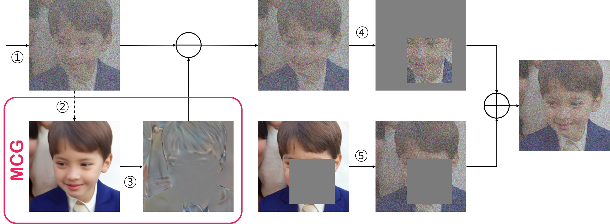
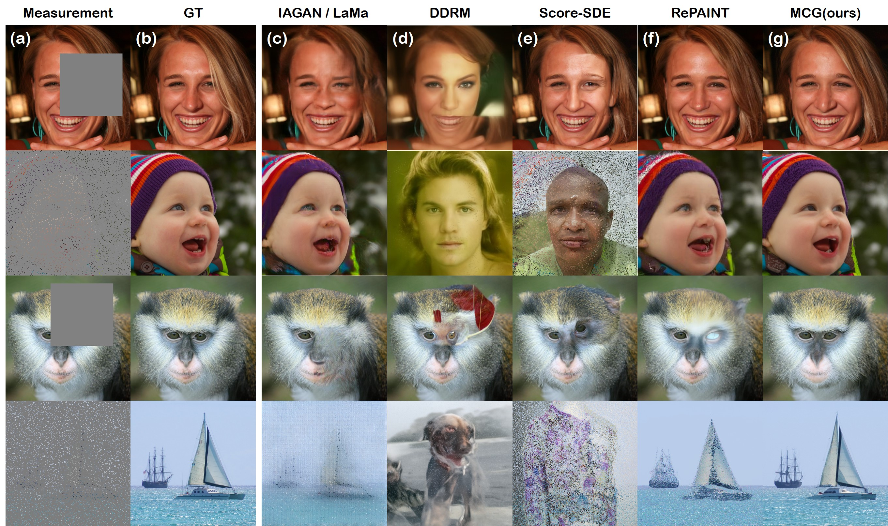
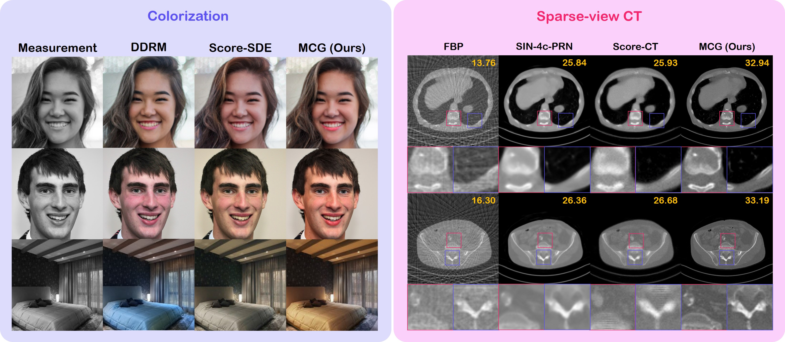

# Improving Diffusion Models for Inverse Problems using Manifold Constraints (NeurIPS 2022)

Official PyTorch implementation of the NeurIPS 2022 paper "[Improving Diffusion Models for Inverse Problems using Manifold Constraints](https://arxiv.org/abs/2206.00941)". Code modified from [guided-diffusion](https://github.com/openai/guided-diffusion) and [score_sde_pytorch](https://github.com/yang-song/score_sde_pytorch).

[](https://arxiv.org/abs/2206.00941)
[](https://arxiv.org/abs/2206.00941)




For each task, we additionally provide some re-implementations of diffusion model-based inverse problem solvers.

> **Improving Diffusion Models for Inverse Problems using Manifold Constraints**<br>
> [Hyungjin Chung](https://www.hj-chung.com/), Hyungjin Chung, [Jong Chul Ye](https://bispl.weebly.com/professor.html) <br>
> NeurIPS 2022
> 
>**Abstract**: <br>
Recently, diffusion models have been used to solve various  inverse problems in an unsupervised manner with appropriate modifications to the sampling process. However, the current solvers, which recursively apply a reverse diffusion step followed by a projection-based measurement consistency step, often produce sub-optimal results. By studying the generative sampling path, here we show that current solvers throw the sample path off the data manifold, and hence the error accumulates. To address this, we propose an additional correction term  inspired by the manifold constraint, which  can be used synergistically with the previous solvers to make the iterations close to the manifold. The proposed manifold constraint is straightforward to implement within a few lines of code, yet boosts the performance by a surprisingly large margin. With extensive experiments, we show that our method is superior to the previous methods both theoretically and empirically, producing promising results in many applications such as image inpainting, colorization, and sparse-view computed tomography.


## Getting Started

### Setting the environment

Our code was tested on the following environment
- Ubuntu 20.04
- CUDA 10.2
- PyTorch 1.6.0

We provide the install script in ```install.sh```. Be sure to have conda ready,
as we will be using conda to build the environment. Once ready, simply run the following command:
```bash
source install.sh
```
The above command will create a conda environment, and install the dependencies listed in ```requirements.txt```.

### Pretrained checkpoints

The install script will automatically download the pre-trained checkpoints and place it in the
```checkpoints``` directory. Alternatively, you may download the pre-trained 
checkpoints used for each task from the links below.

|              | FFHQ 256x256                                                             | ImageNet 256x256                                                      | LSUN-bedroom                                                              | AAPM                                                                      | Original repository                                            |
|--------------|--------------------------------------------------------------------------|-----------------------------------------------------------------------|---------------------------------------------------------------------------|---------------------------------------------------------------------------|----------------------------------------------------------------|
| Inpainting   | [Link](https://www.dropbox.com/s/4r8r6o2n1pumzmg/ffhq_10m.pt?dl=1)       | [Link](https://www.dropbox.com/s/rtit2qsb353262t/imagenet256.pt?dl=0) | [Link](https://www.dropbox.com/s/57bguxpr6by6l1x/lsun_bedroom.pt?dl=1)    | -                                                                         | [Guided diffusion](https://github.com/openai/guided-diffusion) |
| Colorization | [Link](https://www.dropbox.com/s/9m86f0qxqop6pcu/checkpoint_48.pth?dl=1) | -                                                                     | [Link](https://www.dropbox.com/s/06osrjbqy4x8jlm/checkpoint_127.pth?dl=1) | -                                                                         | [Score-SDE](https://github.com/yang-song/score_sde_pytorch)    |
| SV-CT        | -                                                                        | -                                                                     | -                                                                         | [Link](https://www.dropbox.com/s/prk5y3ltqcg6fmu/checkpoint_185.pth?dl=1) | -                                                              |


## Solving Inverse Problems with MCG

For all tasks, we provide some sample data, which is contained in the `samples` folder,
which will be automatically downloaded with the install script. You may alternatively get the data
[here](https://www.dropbox.com/s/pvzww4wuilo4x62/samples.zip?dl=1). All results will be saved in the `results` folder.


### Inpainting

Run the following command to perform inpainting with the default configurations.
```bash
bash run_inpainting.sh
```
You may try other sampling strategies other than `MCG` by changing the flag ```--sample_method```
to `vanilla` ([score-SDE](https://github.com/yang-song/score_sde_pytorch)), or `repaint` ([RePAINT](https://github.com/andreas128/RePaint)).

### Colorization

Run the following command. Change the parameters directly in the python script as needed.
```
python run_colorization.py
```

### Sparse-view CT reconstruction (SV-CT)

Run the following command. Change the parameters directly in the python script as needed.
```
python run_CT_recon.py
```
We additionally provide our re-implementation of this [paper](https://openreview.net/forum?id=vaRCHVj0uGI). Set `solver='song'`
when you wish to run the solver introduced in [Song et al.](https://openreview.net/forum?id=vaRCHVj0uGI).

## Citation
If you find our work interesting, please consider citing

```
@InProceedings{chung2022improving,
  title={Improving Diffusion Models for Inverse Problems using Manifold Constraints},
  author={Chung, Hyungjin and Sim, Byeongsu and Ye, Jong Chul},
  journal={Advances in Neural Information Processing Systems},
  year={2022}
}
```
